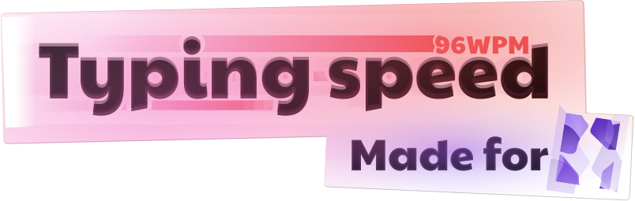
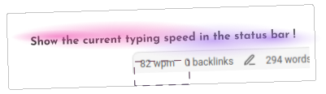

   

<h1 align="center"> Typing speed plugin for obsidian </h1>

This little plugin show the current typing speed in the status bar !

You can choose if you want the current speed being displayed in cps (character per second), cpm (character per minute) or wpm (word per minute).

# License

The "typing speed plugin" source code is under the MIT license.